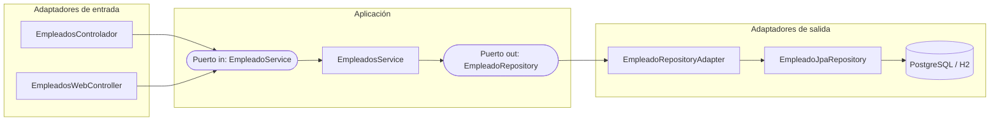
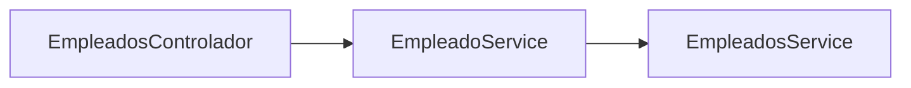
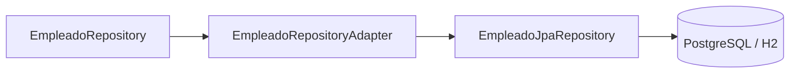
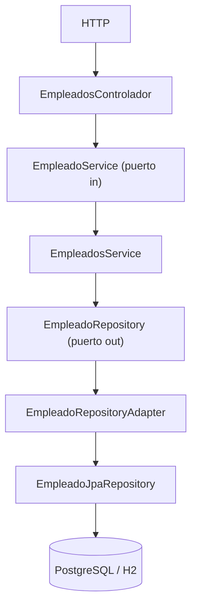
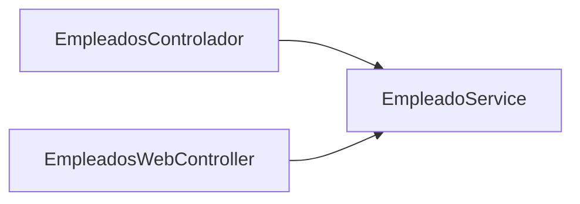

# Spring Boot - Arquitectura Hexagonal

Aplicación Spring Boot que gestiona empleados mediante una API REST y una interfaz web con Thymeleaf, organizada siguiendo **Arquitectura Hexagonal** (Puertos y Adaptadores).

El proyecto está planteado como una aplicación didáctica para comprender cómo se separan el dominio, la lógica de aplicación y las tecnologías externas mediante **puertos e interfaces**.

---

## Quick start

Requisitos: Java 21, Maven, Docker y Docker Compose.

```bash
git clone <url-del-repo>
cd <nombre-del-proyecto>
docker compose up -d
```

La aplicación estará disponible en `http://localhost:8080` y la interfaz web en `http://localhost:8080/web/empleados`.

Si prefieres ejecutar Spring Boot desde Eclipse en vez de Docker, o usar H2 en memoria en lugar de PostgreSQL, consulta la sección [Formas de uso](#formas-de-uso).

---

## Diagrama de la arquitectura



> El mismo `EmpleadoRepositoryAdapter` sirve para PostgreSQL o H2: la base de datos concreta se decide mediante Spring Profiles, no cambia el adaptador ni el puerto.

Los adaptadores de entrada solo conocen el **puerto in**; los adaptadores de salida son invocados a través del **puerto out**.

La aplicación (`EmpleadosService`) nunca depende directamente de ningún adaptador.

De esta forma, la lógica de aplicación queda desacoplada de tecnologías concretas como Spring MVC, JPA, Hibernate o PostgreSQL.

---

## Estructura del proyecto

```text
src/main/java/com.codeja
│
├── RestApplication.java
│
├── domain
│   └── Empleado.java
│
├── application
│   ├── ports
│   │   ├── in
│   │   │   └── EmpleadoService.java
│   │   └── out
│   │       └── EmpleadoRepository.java
│   │
│   └── services
│       └── EmpleadosService.java
│
└── adapters
    ├── in
    │   └── web
    │       ├── EmpleadosControlador.java
    │       └── EmpleadosWebController.java
    │
    └── out
        └── persistence
            ├── EmpleadoEntity.java
            ├── EmpleadoJpaRepository.java
            └── EmpleadoRepositoryAdapter.java
```

### Responsabilidad de cada zona

| Zona | Responsabilidad |
|---|---|
| `domain` | Modelo de dominio |
| `application` | Casos de uso y contratos |
| `adapters/in` | Entrada de peticiones externas |
| `adapters/out` | Comunicación con sistemas externos |
| `RestApplication` | Punto de entrada de Spring Boot |

La dependencia entre capas siempre apunta hacia el interior de la aplicación.

---

## Idea clave: puertos y adaptadores

* **Puerto** → una interfaz Java que define **qué** operaciones necesita u ofrece la aplicación, sin especificar cómo se realizan.
* **Adapter** → conecta la aplicación con el exterior y se encarga de **cómo** se realizan esas operaciones utilizando una tecnología concreta.

```text
PUERTO   → ¿Qué necesitamos / qué ofrecemos?
ADAPTER  → ¿Cómo lo conectamos con el exterior?
```

La aplicación se comunica con el exterior a través de los puertos, evitando depender directamente de las implementaciones concretas de los adaptadores.

Esto permite sustituir una tecnología externa sin tener que modificar la lógica de aplicación.

---

## Puerto de entrada (in)

Define las operaciones que la aplicación ofrece al exterior:

```java
public interface EmpleadoService {
    List<Empleado> getEmpleados();
    Optional<Empleado> getEmpleadoById(long idEmpleado);
    Empleado crearEmpleado(Empleado empleado);
    boolean modificarEmpleado(long idEmpleado, Empleado empleadoModificado);
    boolean eliminarEmpleado(long idEmpleado);
}
```

Lo implementa `EmpleadosService`, que contiene la lógica de aplicación.

Los controladores REST y web conocen únicamente el contrato (`EmpleadoService`), no la implementación concreta.



El Controller no necesita saber cómo se implementa el servicio.

---

## Puerto de salida (out)

Define las operaciones que la aplicación necesita de fuentes externas, como la persistencia:

```java
public interface EmpleadoRepository {
    List<Empleado> buscarTodos();
    Optional<Empleado> buscarPorId(Long id);
    Empleado guardar(Empleado empleado);
    boolean existePorId(Long id);
    void eliminarPorId(Long id);
}
```

Lo implementa `EmpleadoRepositoryAdapter`, que traduce estas operaciones a las llamadas de `EmpleadoJpaRepository`, que finalmente accede a la base de datos.



El puerto define **qué necesita la aplicación**; el adapter decide **cómo realizarlo con la tecnología concreta**.

---

## Flujo de una petición (referencia)

Ejemplo:

```http
GET /empleados/3
```

Este es el recorrido de referencia que se repite (con variaciones menores) en toda la aplicación, y al que se hace referencia en las secciones siguientes:



La respuesta realiza el recorrido inverso. El adaptador de persistencia convierte la `EmpleadoEntity` utilizada por JPA en el objeto `Empleado` del dominio.

---

## Dominio vs Entidad

Una característica importante de la arquitectura es separar el modelo de dominio del modelo utilizado por la persistencia.

### `domain/Empleado.java`

Representa el objeto de dominio. No contiene anotaciones de JPA ni depende directamente de la tecnología de persistencia. En este proyecto es un `record`.

### `adapters/out/persistence/EmpleadoEntity.java`

Representa la entidad utilizada por JPA para trabajar con la base de datos.

El encargado de realizar la conversión entre ambos modelos es `EmpleadoRepositoryAdapter`:

```text
Empleado  ↔  EmpleadoRepositoryAdapter  ↔  EmpleadoEntity
(dominio)                                  (persistencia)
```

La aplicación trabaja con el dominio y no necesita conocer `EmpleadoEntity`.

---

## Persistencia

El proyecto utiliza diferentes configuraciones de base de datos para poder trabajar en distintos escenarios de desarrollo. Actualmente se pueden utilizar:

- H2 en memoria.
- PostgreSQL desde Eclipse.
- PostgreSQL desde Docker.

La elección de la base de datos se realiza mediante **Spring Profiles**.

### H2 en memoria

El perfil `h2` utiliza una base de datos H2 en memoria:

```properties
spring.datasource.url=jdbc:h2:mem:empleados
spring.datasource.username=sa
spring.datasource.password=
spring.datasource.driver-class-name=org.h2.Driver
spring.jpa.hibernate.ddl-auto=create
spring.jpa.show-sql=true
```

Al ser una base de datos en memoria, los datos se pierden al detener la aplicación, y Hibernate recrea las tablas en cada arranque (`ddl-auto=create`).

**Activar el perfil desde Eclipse:**

`Run → Run Configurations... → Arguments → Program arguments`

```text
--spring.profiles.active=h2
```

Spring Boot utilizará entonces `application-h2.properties`.

**Conexión:** Eclipse → Spring Boot → H2 en memoria.

### PostgreSQL desde Eclipse

Para trabajar desde Eclipse con PostgreSQL se utiliza el perfil `eclipse`:

```properties
spring.datasource.url=jdbc:postgresql://localhost:5432/empleados
```

Spring Boot se ejecuta directamente desde Eclipse, mientras PostgreSQL continúa ejecutándose dentro de Docker, con el puerto publicado en `localhost:5432`.

**Activar el perfil:**

```text
--spring.profiles.active=eclipse
```

Spring Boot utilizará `application-eclipse.properties`.

Para levantar únicamente PostgreSQL (no hace falta el servicio `app` de Docker, porque Spring Boot corre desde Eclipse):

```bash
docker compose up -d postgres
```

**Conexión:** Spring Boot (Eclipse/Windows) → `localhost:5432` → PostgreSQL (Docker).

### PostgreSQL desde Docker

Cuando tanto Spring Boot como PostgreSQL se ejecutan dentro de Docker se utiliza el perfil `docker`:

```properties
spring.datasource.url=jdbc:postgresql://postgres:5432/empleados
```

Aquí `postgres` es el nombre del servicio PostgreSQL definido en Docker Compose; el contenedor de Spring Boot usa ese nombre para localizar al de PostgreSQL dentro de la red creada por Compose.

El perfil se activa desde `compose.yml`:

```yaml
environment:
  SPRING_PROFILES_ACTIVE: docker
```

Al ejecutar `docker compose up -d`, Spring Boot utiliza `application-docker.properties`.

**Conexión:** Spring Boot (Docker) → `postgres:5432` → PostgreSQL (Docker).

---

## Spring Profiles

La configuración de los diferentes entornos se organiza así:

```text
src/main/resources/
│
├── application.properties          (configuración común)
├── application-h2.properties
├── application-eclipse.properties
└── application-docker.properties
```

### Resumen de los perfiles

| Perfil | Dónde corre Spring Boot | Base de datos | Conexión |
|---|---|---|---|
| `h2` | Eclipse | H2 en memoria | `jdbc:h2:mem:empleados` |
| `eclipse` | Eclipse | PostgreSQL en Docker | `localhost:5432` |
| `docker` | Docker | PostgreSQL en Docker | `postgres:5432` |

De esta forma no es necesario modificar manualmente la URL de conexión al cambiar de entorno: simplemente se cambia el perfil activo.

---

## Docker

El proyecto utiliza Docker Compose para gestionar PostgreSQL y la aplicación Spring Boot.

```text
Docker Compose
      │
      ├── Spring Boot   → Puerto 8080
      │
      └── PostgreSQL    → Puerto 5432 → Docker Volume
```

PostgreSQL utiliza la imagen `postgres:16-alpine`. La base de datos utilizada por la aplicación es `empleados`. El volumen Docker permite conservar los datos aunque el contenedor de PostgreSQL se detenga, se reinicie o se vuelva a crear.

### Dockerfile

La aplicación Spring Boot se construye mediante un Dockerfile **multi-stage**:

1. **Build**: Maven + JDK 21 compilan la aplicación y generan el JAR.
2. **Runtime**: JRE 21 Alpine ejecuta únicamente el JAR ya compilado.

De esta forma el contenedor final contiene solo lo necesario para ejecutar la aplicación.

### Comandos útiles

```bash
docker compose up -d          # levantar PostgreSQL y Spring Boot
docker compose up -d --build  # reconstruir la imagen tras cambios
docker compose ps             # comprobar el estado
```

---

## Formas de uso

### 1. Ejecutar todo con Docker

```text
Docker Compose
      │
      ├── Spring Boot
      └── PostgreSQL
```

```bash
docker compose up -d
```

Spring Boot utiliza el perfil `docker` y se conecta mediante `postgres:5432`.

### 2. Ejecutar Spring Boot desde Eclipse

Solo PostgreSQL se ejecuta mediante Docker:

```bash
docker compose up -d postgres
```

Spring Boot se ejecuta directamente desde Eclipse, seleccionando el perfil correspondiente según la base de datos deseada:

```text
--spring.profiles.active=h2
```
o
```text
--spring.profiles.active=eclipse
```

```text
                 Eclipse
                    │
          ┌─────────┴─────────┐
          ▼                   ▼
         h2                eclipse
          │                   │
          ▼                   ▼
         H2              PostgreSQL
      en memoria          (Docker)
```

---

## API REST

La API REST se puede probar mediante Postman.

| Acción | Método y ruta | Body |
|---|---|---|
| Listar empleados | `GET /empleados` | — |
| Obtener por ID | `GET /empleados/{id}` | — |
| Crear empleado | `POST /empleados` | `{ "nombre": "Nuevo empleado" }` |
| Modificar empleado | `PUT /empleados/{id}` | `{ "nombre": "Nombre modificado" }` |
| Eliminar empleado | `DELETE /empleados/{id}` | — |
| Endpoint de prueba | `GET /empleados/test` | Devuelve un empleado de prueba en JSON |

Ejemplo:

```http
GET http://localhost:8080/empleados/3
```

---

## Interfaz web con Thymeleaf

Además de la API REST, el proyecto incluye una interfaz web basada en Thymeleaf, accesible en:

```text
http://localhost:8080/web/empleados
```

Los dos adaptadores de entrada (API REST e interfaz web) utilizan el mismo puerto de entrada, `EmpleadoService`, por lo que ambos terminan ejecutando la misma lógica de aplicación:



---

## ¿Por qué usar esta arquitectura?

La arquitectura hexagonal permite separar la lógica de aplicación de las tecnologías externas. Entre sus principales ventajas:

* Permite **sustituir tecnologías** creando nuevos adaptadores que implementen los mismos puertos, sin modificar la lógica de aplicación.
* Facilita el **testing**, al poder utilizar implementaciones alternativas o mocks de los puertos.
* Separa la lógica de aplicación de tecnologías externas como JPA, Hibernate o PostgreSQL.
* Permite que diferentes formas de entrada utilicen los mismos casos de uso.
* Hace explícita la dirección de las dependencias.

También introduce más complejidad inicial que una arquitectura de capas tradicional (`Controller → Service → Repository → Base de datos`). Por tanto, aporta valor principalmente cuando se necesita un mayor desacoplamiento de las tecnologías externas.

---

## Cómo trabajar añadiendo nuevas funcionalidades

Cuando se añade una nueva funcionalidad, se debe identificar primero si se trata de una nueva operación que ofrece la aplicación o de una nueva dependencia externa que necesita la aplicación.

1. **Puerto de entrada** — si la aplicación debe ofrecer una nueva operación al exterior, se define en el puerto `in`.
2. **Lógica de aplicación** — la implementación de la operación se realiza en `EmpleadosService`.
3. **Puerto de salida** — si la operación necesita acceder a una tecnología externa, se define el contrato correspondiente en el puerto `out`.
4. **Adaptador** — se implementa el adaptador que conecta el puerto con la tecnología concreta.

La idea principal es que **la aplicación dependa de interfaces y no de implementaciones concretas**.

---

## Evolución del proyecto

El proyecto se ha construido progresivamente para incorporar diferentes conceptos de Spring Boot manteniendo la separación de responsabilidades de la arquitectura hexagonal:

```text
API REST → Arquitectura Hexagonal → Puerto de entrada → Servicio de aplicación
→ Puerto de salida → Adaptador de persistencia → JPA/Hibernate → H2 → PostgreSQL
→ Docker → Docker Compose → Spring Profiles → Ejecución desde Eclipse/Docker
```

Actualmente el proyecto permite utilizar tres escenarios de ejecución (ver [tabla de perfiles](#resumen-de-los-perfiles)).

La siguiente evolución del proyecto será incorporar **Spring Security**, manteniendo la separación entre dominio, aplicación y adaptadores y estudiando dónde debe situarse la configuración de seguridad dentro de la arquitectura hexagonal.
