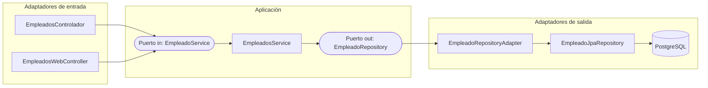

# Spring Boot - Arquitectura Hexagonal

Aplicación Spring Boot que gestiona empleados mediante una API REST y una interfaz web con Thymeleaf, organizada siguiendo **Arquitectura Hexagonal** (Puertos y Adaptadores).

## Diagrama de la arquitectura



Los adaptadores de entrada solo conocen el **puerto in**; los adaptadores de salida son invocados a través del **puerto out**. La aplicación (`EmpleadosService`) nunca depende directamente de ningún adaptador.

## Estructura del proyecto

```text
src/main/java/com.codeja
│
├── RestApplication.java
│
├── domain
│   └── Empleado.java
│
├── application
│   ├── ports
│   │   ├── in
│   │   │   └── EmpleadoService.java
│   │   └── out
│   │       └── EmpleadoRepository.java
│   └── services
│       └── EmpleadosService.java
│
└── adapters
    ├── in
    │   └── web
    │       ├── EmpleadosControlador.java
    │       └── EmpleadosWebController.java
    │
    └── out
        └── persistence
            ├── EmpleadoEntity.java
            ├── EmpleadoJpaRepository.java
            └── EmpleadoRepositoryAdapter.java
```

## Idea clave: puertos y adaptadores

* **Puerto** → una interfaz Java que define **qué** operaciones necesita u ofrece la aplicación, sin especificar cómo se realizan.
* **Adapter** → conecta la aplicación con el exterior y se encarga de **cómo** se realizan esas operaciones utilizando una tecnología concreta.

```text
PUERTO   → ¿Qué necesitamos / qué ofrecemos?
ADAPTER  → ¿Cómo lo conectamos con el exterior?
```

La aplicación se comunica con el exterior a través de los puertos, evitando depender directamente de las implementaciones concretas de los adaptadores.

## Puerto de entrada (in)

Define las operaciones que la aplicación ofrece al exterior:

```java
public interface EmpleadoService {
    List<Empleado> getEmpleados();
    Optional<Empleado> getEmpleadoById(long idEmpleado);
    Empleado crearEmpleado(Empleado empleado);
    boolean modificarEmpleado(long idEmpleado, Empleado empleadoModificado);
    boolean eliminarEmpleado(long idEmpleado);
}
```

Lo implementa `EmpleadosService`, que contiene la lógica de aplicación.

Los controladores REST y web conocen únicamente el contrato (`EmpleadoService`), no la implementación concreta.

## Puerto de salida (out)

Define las operaciones que la aplicación necesita de fuentes externas, como la persistencia:

```java
public interface EmpleadoRepository {
    List<Empleado> buscarTodos();
    Optional<Empleado> buscarPorId(Long id);
    Empleado guardar(Empleado empleado);
    boolean existePorId(Long id);
    void eliminarPorId(Long id);
}
```

Lo implementa `EmpleadoRepositoryAdapter`, que traduce estas operaciones a las llamadas de `EmpleadoJpaRepository`, que finalmente accede a la base de datos.

```text
EmpleadoRepository
        ↓
   (puerto / interfaz)
        ↓
EmpleadoRepositoryAdapter
        ↓
EmpleadoJpaRepository
        ↓
    PostgreSQL
```

El puerto define **qué necesita la aplicación**; el adapter decide **cómo realizarlo con la tecnología concreta**.

## Flujo de una petición

Ejemplo: `GET /empleados/3`

```text
HTTP
  ↓
EmpleadosControlador
  ↓
EmpleadoService          ← puerto de entrada
  ↓
EmpleadosService         ← lógica de aplicación
  ↓
EmpleadoRepository       ← puerto de salida
  ↓
EmpleadoRepositoryAdapter
  ↓
EmpleadoJpaRepository
  ↓
PostgreSQL
```

La respuesta recorre el camino inverso, convirtiendo `EmpleadoEntity` (JPA) de vuelta a `Empleado` (dominio).

## Dominio vs Entidad

* `domain/Empleado.java`: objeto de dominio, sin anotaciones de JPA ni dependencias externas. En este proyecto es un `record`.
* `adapters/out/persistence/EmpleadoEntity.java`: entidad JPA utilizada para trabajar con la base de datos.

El `Adapter` es responsable de convertir entre ambos modelos.

```text
Empleado          → objeto de dominio
EmpleadoEntity    → objeto de persistencia

        ↕
EmpleadoRepositoryAdapter
```

## ¿Por qué usar esta arquitectura?

* Permite **sustituir tecnologías** creando nuevos adaptadores que implementen los mismos puertos, sin modificar la lógica de aplicación.
* Facilita el **testing**, al poder utilizar implementaciones alternativas o mocks de los puertos.
* Separa la lógica de aplicación de tecnologías externas como JPA, Hibernate o PostgreSQL.
* Introduce más complejidad inicial que una arquitectura de capas tradicional:

```text
Controller → Service → Repository → Base de datos
```

Por tanto, la arquitectura hexagonal aporta valor principalmente cuando se necesita un mayor desacoplamiento de las tecnologías externas.

## Cómo trabajar añadiendo nuevas funcionalidades

1. Define el contrato necesario en el **puerto** correspondiente (`in` o `out`).
2. Si es un puerto de entrada, implementa la lógica en el **servicio de aplicación**.
3. Si es un puerto de salida, crea o modifica el **adapter** para conectar ese contrato con la tecnología externa correspondiente.
4. Los componentes externos deben depender de los **puertos (interfaces)** y no de las implementaciones concretas.

## Formas de uso

El proyecto utiliza Docker Compose para ejecutar PostgreSQL y la aplicación.

### 1. Ejecutar todo con Docker Compose

Para levantar PostgreSQL y la aplicación Spring Boot en contenedores:

```bash
docker compose up -d
```

La aplicación estará disponible en:

```text
http://localhost:8080
```

### 2. Ejecutar la aplicación desde Eclipse u otro IDE

Si estamos modificando y probando rápidamente el código desde Eclipse, no es necesario ejecutar también la aplicación dentro de Docker.

Podemos levantar únicamente el contenedor de PostgreSQL:

```bash
docker compose up -d postgres
```

A continuación, ejecutamos `RestApplication` directamente desde Eclipse (o desde el IDE utilizado).

La aplicación Spring Boot se ejecutará en:

```text
http://localhost:8080
```

## Endpoints REST

La API REST se puede probar mediante Postman.

**Obtener todos los empleados**

```http
GET http://localhost:8080/empleados
```

**Obtener un empleado por ID**

```http
GET http://localhost:8080/empleados/{id}
```

Ejemplo:

```http
GET http://localhost:8080/empleados/3
```

**Crear un empleado**

```http
POST http://localhost:8080/empleados
```

Body → `raw` → `JSON`:

```json
{
    "nombre": "Nuevo empleado"
}
```

**Modificar un empleado**

```http
PUT http://localhost:8080/empleados/{id}
```

Ejemplo:

```http
PUT http://localhost:8080/empleados/3
```

Body → `raw` → `JSON`:

```json
{
    "nombre": "Nombre modificado"
}
```

**Eliminar un empleado**

```http
DELETE http://localhost:8080/empleados/{id}
```

Ejemplo:

```http
DELETE http://localhost:8080/empleados/3
```

**Endpoint de prueba**

Para comprobar rápidamente que el Controller REST está funcionando:

```http
GET http://localhost:8080/empleados/test
```

Devuelve un empleado de prueba en formato JSON.

## Interfaz web con Thymeleaf

Además de la API REST, el proyecto incluye una interfaz web basada en Thymeleaf.

Se puede acceder desde el navegador mediante:

```text
http://localhost:8080/web/empleados
```

Esta interfaz permite visualizar los empleados y acceder a las vistas relacionadas con su gestión.

Por tanto, el proyecto dispone de dos formas de acceso a la aplicación:

```text
API REST
    ↓
/empleados
    ↓
JSON
    ↓
Postman / aplicaciones cliente


Interfaz Web
    ↓
/web/empleados
    ↓
HTML + Thymeleaf
    ↓
Navegador
```
